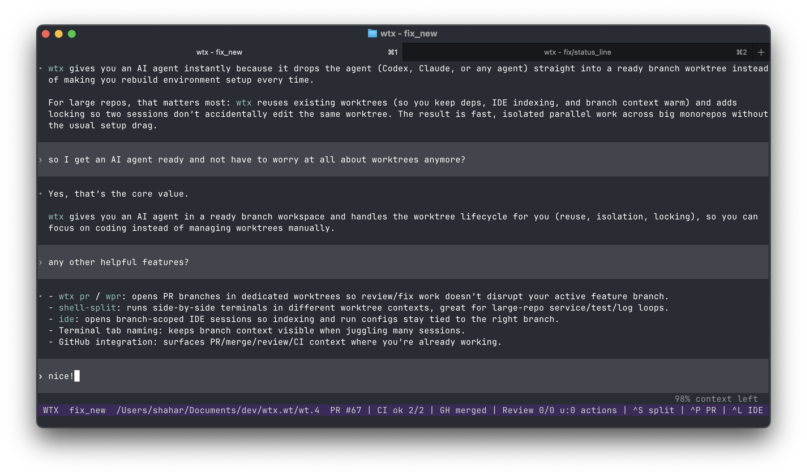

# wtx: monorepo-first worktrees for AI agents
`wtx` starts each agent session in its own ready branch worktree so teams can run truly parallel agent workflows.
Reuse + locking keeps those parallel worktrees fast, isolated, and safe in large monorepos.



## Quickstart

```sh
wtx checkout -b feat/first # or wco -b with aliases enabled
# open another terminal
wtx checkout -b feat/second
# profit!
```

## Installation

```sh
go install github.com/mrbonezy/wtx/cmd/wtx@latest
```

## Why wtx
Common worktree flows treat worktrees as ephemeral. In large monorepos, that gets slow fast:
- `git worktree add`
- dependency installation
- repeated IDE project indexing/setup

`wtx` makes worktrees practical at scale with:
- Worktree reuse: jump back into existing branch environments instead of recreating them.
- Locking: prevent two sessions (or agents) from mutating the same worktree concurrently.

That keeps parallel work fast, isolated, and safer for multi-agent workflows.

## Other Features
- `wtx pr` / `wpr`: open PR branches directly into dedicated worktrees, so review/fix flows do not disrupt active feature branches.
- `shell-split`: split terminals into separate worktree contexts, which is useful when monorepo tasks require side-by-side services, logs, or test loops.
- `ide`: open branch-specific IDE sessions so indexing, local run configs, and edits stay scoped to the right worktree.
- Terminal tab naming: keeps branch context visible while juggling many monorepo sessions.
- GitHub integration: surfaces merge, review, and CI status where you are already working.

## License
[MIT](LICENSE)
